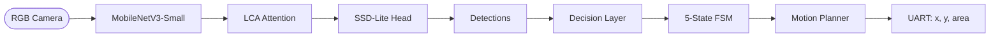

# LEAD-Net

**L**ightweight **E**dge-aware **A**ttention **D**etection **Net**work

> 面向嵌入式设备的实时视觉感知系统 —— 让小车看得见、追得上、绕得开。

[](https://www.python.org/)
[](https://pytorch.org/)
[](https://developer.nvidia.com/cuda-toolkit)
[](LICENSE)

---

## 这是什么？

LEAD-Net 是一个为**智能小车**设计的轻量级视觉感知系统。它只用一个 RGB 摄像头，就能同时完成：

- 检测前方的人和障碍物
- 锁定并持续追踪指定目标
- 判断是否需要绕行
- 自主规划避障路径
- 丢失目标后自动搜索重拾

最终通过 UART 输出 `(x, y, area)` 三个值给 STM32 执行 PID 控制，**通信协议极简，不挑下位机**。

**目标平台：** OpenMV H7 Plus（STM32H743, 480 MHz, 1 MB RAM）  
**训练平台：** RTX 5090 / 云端 GPU  
**适用场景：** 智能小车竞赛、自动驾驶教学、嵌入式 AI 研究

---

## 系统一览



### 感知层

| 组件 | 说明 |
| ------ | ------ |
| Backbone | MobileNetV3-Small，ImageNet 预训练，3 层多尺度特征输出 |
| LCA | 轻量坐标感知注意力，专为障碍检测设计，仅增 ~2K 参数 |
| Detection Head | SSD-Lite，深度可分离卷积，2475 个锚框覆盖 16-224px 目标 |

### 决策与控制层

| 组件 | 说明 |
| ------ | ------ |
| Decision Engine | 五层过滤：置信度 → ROI → 距离估计 → DL/CV 融合 → 风险评估 |
| Behavior FSM | SEARCHING → TRACKING → OBSTACLE_DETECTED → AVOIDING → TARGET_REACQUIRE |
| NSA-KF Tracker | 噪声自适应 Kalman + DIOU 匹配，遮挡 3-5 帧不丢失 |
| APF Avoider | 人工势场法虚拟斥力，输出坐标偏置让 STM32 自然绕行 |
| Speed Controller | 五级 BBox 面积 → 速度映射，靠近目标自动减速 |
| Reacquisition | 螺旋搜索 + ROI 扩展 + 路径记忆，丢失后自主找回目标 |
| CV Fallback | 传统视觉兜底：地面分割 + Blob 检测，DL 失效时接管 |

---

## 性能

| 指标 | 值 | 备注 |
| ------ | --- | ------ |
| 模型大小 | 1.36M 参数 | MobileNetV3-Small (1.31M) + SSD-Lite Head (45K) |
| 输入分辨率 | 320 × 320 | 可配置 |
| 可检测类别 | 7 类 | person, bicycle, car, backpack, suitcase, chair, bottle |
| 同时追踪目标数 | ≤ 3 | 可配置 |
| 遮挡容忍 | 3-5 帧 | NSA-KF 预测桥接 |
| 输出协议 | UART `x{cx},y{cy},a{area}\r\n` | 兼容标准 STM32 PID |
| mAP@0.5 | *待训练* | 云端全量训练后填入 |
| 推理速度 | *待部署* | OpenMV H7+ 实测后填入 |

> 以上性能指标将在云端训练和 OpenMV 部署完成后更新。

---

## 快速开始

### 环境

- Python 3.11+ · PyTorch 2.11+ · CUDA 12.0+
- 训练推荐 ≥ 16 GB 显存；推理可在 CPU 或 OpenMV 上运行

```bash
pip install -r requirements.txt
```

### 5 分钟跑通

```bash
# 1. 准备数据集
python tools/prepare_lead_dataset.py

# 2. 冒烟测试（验证管线完整）
python tools/train.py --config configs/train_baseline.yaml --smoke

# 3. 正式开始训练
python tools/train.py --config configs/train_baseline.yaml
```

### 评估与可视化

```bash
# COCO mAP 评估
python tools/eval.py --config configs/train_baseline.yaml \
    --weights outputs/checkpoints/best.pth

# 预测框可视化（绿=GT, 红=Pred）
python tools/visualize_predictions.py \
    --config configs/train_baseline.yaml \
    --weights outputs/checkpoints/last.pth \
    --num-images 10 --score-threshold 0.01
```

### 快速诊断

```bash
python tools/overfit_test.py --config configs/train_lca.yaml       # 过拟合测试
python tests/test_decode_eval.py                                    # 坐标验证
python tools/short_test.py --config configs/train_lca.yaml --samples 150 --epochs 15
```

---

## 项目结构

```text
LEAD-Net/
├── configs/                  # YAML 配置（继承式，消融实验只改一行）
├── lead_net/
│   ├── models/               # Backbone · LCA · SSD-Lite · Loss
│   ├── data/                 # Dataset · Transforms · DataLoader
│   ├── engine/               # Trainer · Evaluator · Scheduler · Checkpoint
│   ├── tracking/             # NSA-KF · DIOU · MOSSE
│   ├── decision/             # ROI · Priority · Risk · Fusion
│   ├── motion/               # FSM · APF · Speed · Reacquisition
│   ├── cv_fallback/          # 传统 CV 兜底
│   ├── quant/                # QAT 量化感知训练
│   ├── compress/             # 通道剪枝
│   ├── distill/              # 多教师知识蒸馏
│   └── utils/                # Config · Path · Experiment
├── tools/                    # 命令行入口（train / eval / 可视化 / 诊断）
├── tests/                    # 单元测试（10+ 文件）
├── deploy/openmv/            # OpenMV 部署
├── docs/                     # 详细文档
├── docxs/                    # 研究资料与设计文档
└── requirements.txt
```

---

## 数据集

7 类障碍物（person, bicycle, car, backpack, suitcase, chair, bottle），约 20,000 张训练图片，YOLO-txt 标注格式。

| 划分 | 数量 | 来源 |
| ------ | --- | ------ |
| Train | ~20,000 | COCO 2017（类别均衡采样）+ KITTI |
| Val | ~2,200 | COCO 2017 val |
| Test | ~4,900 | KITTI（独立泛化评估） |

数据增强：Mosaic (p=0.5) + RandomHorizontalFlip + ColorJitter

---

## 配置

消融实验通过 YAML 继承实现，**只改一行差异**：

```yaml
# train_baseline.yaml — 基线
inherit: "lead_subset.yaml"
model.lca.enabled: false

# train_lca.yaml — 实验组
inherit: "lead_subset.yaml"
model.lca.enabled: true
```

核心训练配置：

| 项目 | 值 |
| ------ | --- |
| 优化器 | SGD, momentum=0.9, nesterov |
| 学习率 | LLRD 五级：head=3e-3 → backbone_first=9e-5 |
| 调度器 | Linear Warmup (500 iter) + Cosine Annealing |
| 训练策略 | 两阶段：冻结 Backbone → LLRD 联合训练 |
| 混合精度 | AMP + GradScaler |
| Batch Size | 64（支持 `auto` 自适应） |

详见 [configs/](configs/) 和 [docs/](docs/)。

---

## 测试

```bash
python tests/test_imports.py         # 导入冒烟
python tests/test_decode_eval.py     # decode/eval 坐标验证
python tests/test_lca.py             # LCA 注意力模块
python tests/test_data_pipeline.py   # 数据管线
python tests/test_kalman_filter.py   # Kalman 滤波器
python tests/test_tracker.py         # 多目标追踪
python tests/test_decision.py        # 三层决策
python tests/test_cv_fallback.py     # CV 兜底
```

---

## 谁应该用这个项目？

- 做智能小车竞赛、需要视觉避障和追踪的学生/团队
- 研究嵌入式深度学习部署的开发者
- 需要一个轻量级目标检测 + 追踪完整 pipeline 的研究者

## 不适合什么场景？

- 高精度通用目标检测（用 YOLOv8/RT-DETR）
- 多摄像头、激光雷达融合
- 需要检测超过 7 类物体的场景
- 实时性要求 > 30 FPS 的高动态场景

---

## 引用

```bibtex
@misc{lead-net,
  title   = {LEAD-Net: Lightweight Edge-aware Attention Detection Network
             for Embedded Obstacle Perception},
  year    = {2026},
  note    = {In preparation}
}
```

## 许可证

MIT
